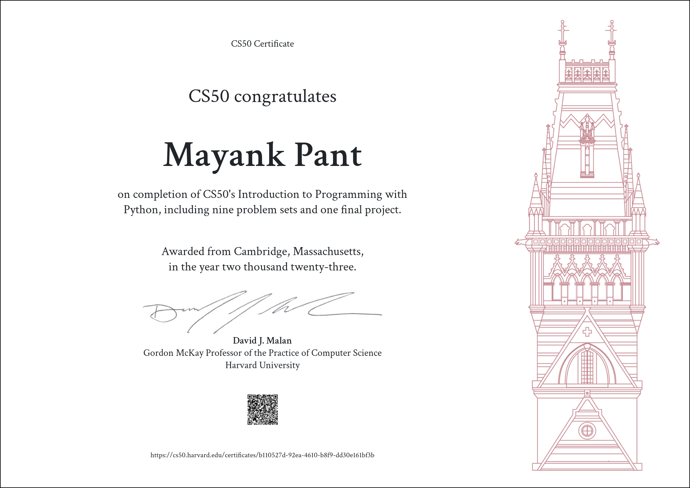
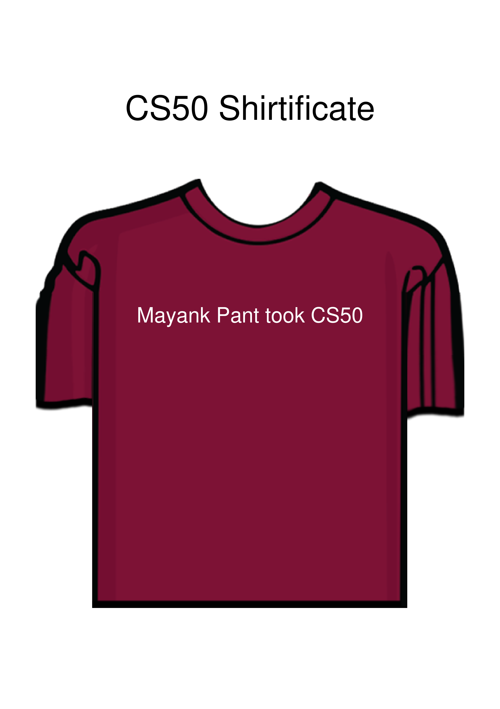

# CS50P

**CS50P: Introduction to Programming with Python** is an online course that teaches the basics of programming using the Python language. The course is designed for students with no prior programming experience, and it covers topics such as functions, variables, conditionals, loops, objects, and exceptions. The course also includes hands-on exercises that allow students to practice what they have learned.

The course is taught by David J. Malan, a professor of computer science at Harvard University. Malan is a well-respected educator and has won numerous awards for his teaching. He is also the creator of the popular CS50 course, which is one of the most popular online computer science courses in the world.

CS50P is a great way to learn the basics of programming with Python. The course is well-designed and easy to follow, and Malan is an excellent teacher. If you are interested in learning to program, CS50P is a great place to start.

Here are some of the key benefits of taking Harvard's CS50P course:

* Learn the basics of programming using a popular language, Python.
* Get hands-on experience with programming through practice exercises.
* Be taught by a well-respected educator and creator of the popular CS50 course.
* Learn at your own pace and on your own time.

If you are interested in learning to program, I highly recommend taking Harvard's CS50P course. It is a great way to get started with programming and learn the basics of Python.

# Certificate
-------------------------------------------------------------------

# Shirtificate
-------------------------------------------------------------------

